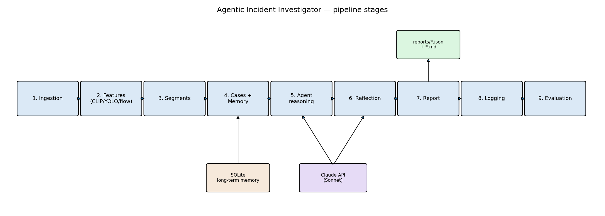

# Agentic Incident Investigator for Surveillance Video

A CPU-only pipeline that watches surveillance video, flags candidate activity
(fighting, vandalism, fire/smoke) with pretrained CLIP + YOLO models, and then hands
those raw detections to an LLM agent that checks them against a camera's own
historical false-positive record before writing a final incident report.

## The headline result

On the Arson test clip, the CV layer was about as confident as it gets that this was
a real fire — and the agent, using nothing but this camera's own track record,
correctly overrode it:

| | value |
|---|---|
| Raw CLIP confidence (Stage 3) | **0.997** |
| Revised confidence, after agent reasoning (Stage 5) | **0.05** |
| Final confidence, after reflection audit (Stage 6) | **0.05** |
| Verdict | `downgraded` |
| Why | this camera has a 100% historical false-positive rate on `fire_smoke` at this hour |

That's a 0.997 raw score turning into a final 0.05 because of what this specific
camera has gotten wrong before — not a hardcoded rule, an LLM weighing the CNN's
confidence against memory context and deciding the CNN was wrong this time. Full
reasoning trace: [reports/drone_fire_and_smoke_11584957.md](reports/drone_fire_and_smoke_11584957.md).

## Architecture



Nine stages, each its own module: ingestion → CLIP/YOLO/optical-flow features →
segment merging → case bundling with short/long-term memory → LLM reasoning →
LLM reflection (a second pass that audits the first) → structured report →
consolidated logging → evaluation. Full rationale for every design choice
(why CLIP over training a model, why SQLite, why the "no memory" condition had to be
a structurally different prompt and not just empty fields) is in [report.md](report.md).

## See it for yourself — no setup required

These are real outputs from real runs, already sitting in this repo:

- **[report.md](report.md)** — the full writeup: architecture, the memory-ablation
  finding above in context, evaluation results with their honest caveats, and a
  debugging writeup of a real bug hit along the way.
- **[reports/drone_fire_and_smoke_11584957.md](reports/drone_fire_and_smoke_11584957.md)**
  — the incident report behind the headline result, human-readable.
- **[evaluation/evaluation_summary.md](evaluation/evaluation_summary.md)** — the
  memory-ablation comparison table (none / short-term / short+long-term memory) and
  CV detection metrics, generated by `run_evaluate.py`.

`reports/` and `logs/` also have the other three test clips (fighting, vandalism,
normal/idle) if you want to see the range of outputs, not just the one headline case.

## Running it yourself (optional)

Everything above is static output already in the repo — you don't need to run
anything to look at the results. If you want to regenerate them or point the
pipeline at your own footage:

```bash
pip install -r requirements.txt
export ANTHROPIC_API_KEY=sk-ant-...   # needed for Stages 5/6 (agent + reflection) onward
```

Needs Python 3.10+. First run auto-downloads CLIP (ViT-B-32, openai weights) and
YOLOv8n weights (a few hundred MB, one-time).

```bash
python run_orchestrator.py data/raw/Arson/drone_fire_and_smoke_11584957.mp4
```

Runs Stages 1–7 end to end on that clip and rewrites `logs/<video_id>.json` and
`reports/<video_id>.json`/`.md`. Point it at any clip under `data/raw/`, or your own
video — nothing in Stages 1–8 is dataset-specific.

Each stage also has its own module (`incident_investigator/<stage>.py`) and a thin
demo script at the repo root (`run_<stage>.py`) that runs just that stage in
isolation:

```bash
python run_ingestion.py data/raw/Fighting/two_boys_fighting_10505848.mp4
python run_features.py    # stages 1-2
python run_segments.py    # stages 1-3
python run_cases.py       # stages 1-4
python run_agent.py       # stages 1-5
python run_reflection.py  # stages 1-6, plus one synthetic test case
python run_report.py      # stages 1-7
```

Evaluation (both CV metrics and the memory ablation) is `python run_evaluate.py` —
this one spends real API calls (3 memory configs × number of cases × 2 LLM calls
each), so check `evaluation_summary.md`'s `LLM calls` column before rerunning it on
a larger clip set.

## Data

`data/raw/<class>/*.mp4` — see [data/raw/README.md](data/raw/README.md). Currently
placeholder stock footage standing in for UCF-Crime clips (Kaggle auth blocked —
specifics in report.md's limitations section). `download_data.py` is left in place,
unused, ready to point at the real dataset once valid Kaggle credentials exist.

`data/ground_truth.json` — hand-labeled activity intervals for the 4 test clips.

`data/long_term_memory.db` — SQLite long-term memory store, seeded with 4 synthetic
placeholder rows (`incident_investigator/memory.py`'s `seed_demo_data`) since no real
incident history exists yet.

## Pipeline stages

| # | Stage | Module | Status |
|---|---|---|---|
| 1 | Ingestion (frame sampling, windowing) | `incident_investigator/ingestion.py` | done |
| 2 | Per-window features (CLIP, YOLO, optical flow) | `incident_investigator/features.py` | done |
| 3 | Segment merging | `incident_investigator/segments.py` | done |
| 4 | Case bundling + memory | `incident_investigator/cases.py`, `incident_investigator/memory.py` | done |
| 5 | Agent reasoning | `incident_investigator/agent.py` | done |
| 6 | Reflection | `incident_investigator/agent.py` | done |
| 7 | Report generation | `incident_investigator/report.py` | done |
| 8 | Logging | `incident_investigator/orchestrator.py` | done |
| 9 | Evaluation | `incident_investigator/evaluate.py` | done |
| 10 | Visualization | *(covered by Stage 9's `plot_ablation` — no separate module)* | n/a |

## Outputs

- `reports/<video_id>.json` / `.md` — per-video structured incident report (Stage 7)
- `logs/<video_id>.json` — full per-video pipeline trace: every stage's intermediate
  output, per-stage timing, LLM call count (Stage 8)
- `evaluation/` — Stage 9's CV metrics, memory-ablation summary, and chart
